<div align="center">

# Alfin Almustajab — Official Web Portfolio

**Front-End Developer & IT Support** · Nuxt 4 + Supabase + Gemini AI

A premium, single-page personal portfolio with a policy-bound **AI Assistant (RAG)**,
a full **admin panel**, bilingual support (ID/EN), visitor analytics and buttery-smooth
GSAP + Lenis + Motion animations.

[](https://nuxt.com)
[](https://vuejs.org)
[](https://supabase.com)
[](https://tailwindcss.com)
[](https://ai.google.dev)
[](https://gsap.com)
[](https://vercel.com)

</div>

---

## 🖥️ Preview

> Screenshots diambil langsung dari aplikasi yang berjalan (desktop & mobile).

### Homepage Sections

| | | |
|:---:|:---:|:---:|
| 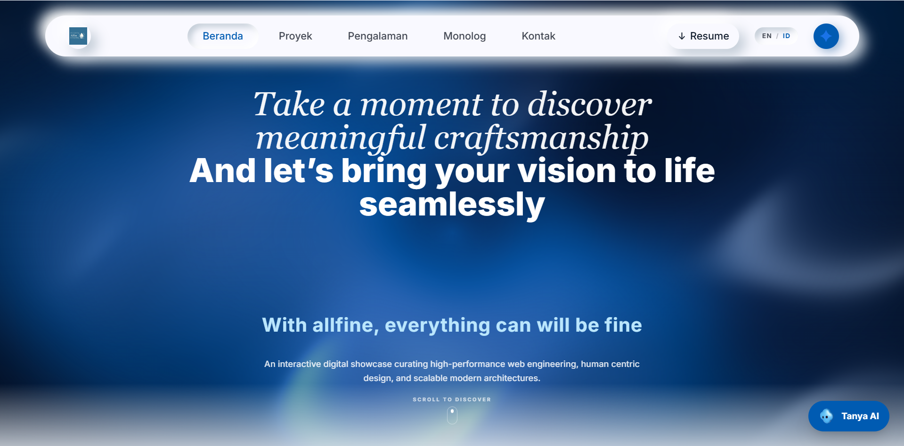 | 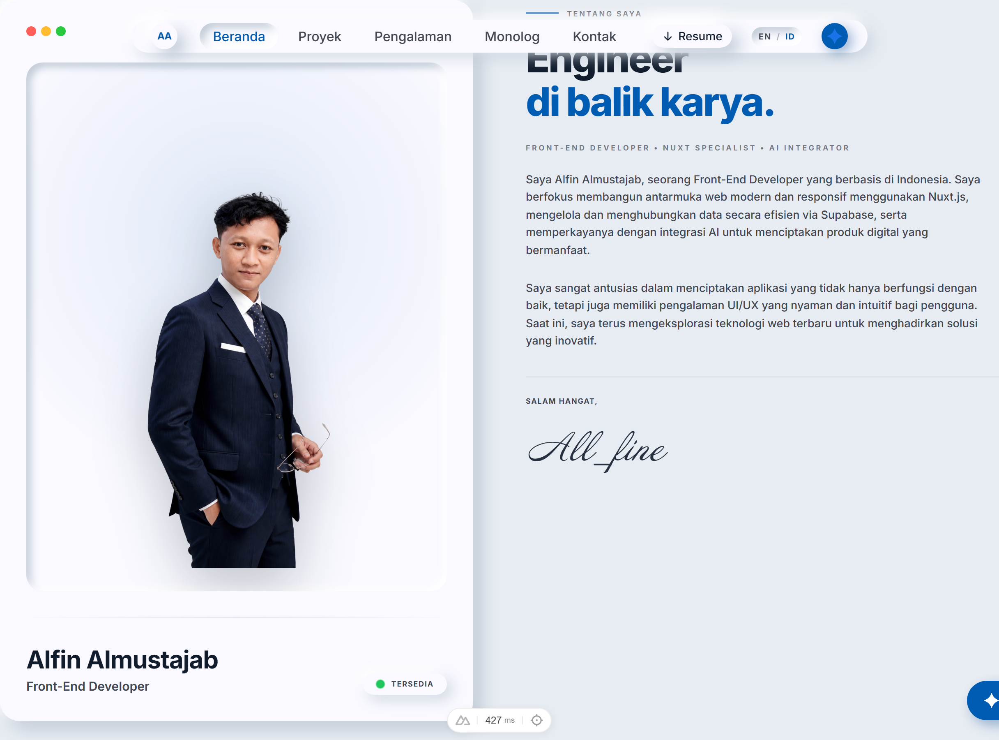 | 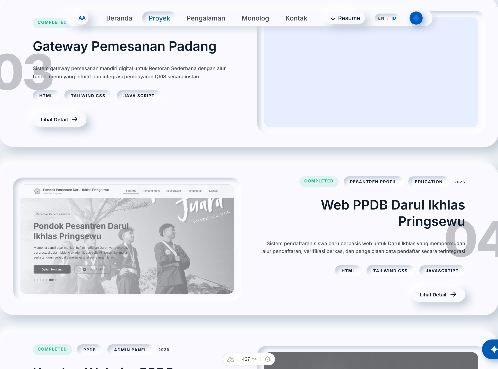 |
| **Hero** | **About** | **Featured Projects** |
| 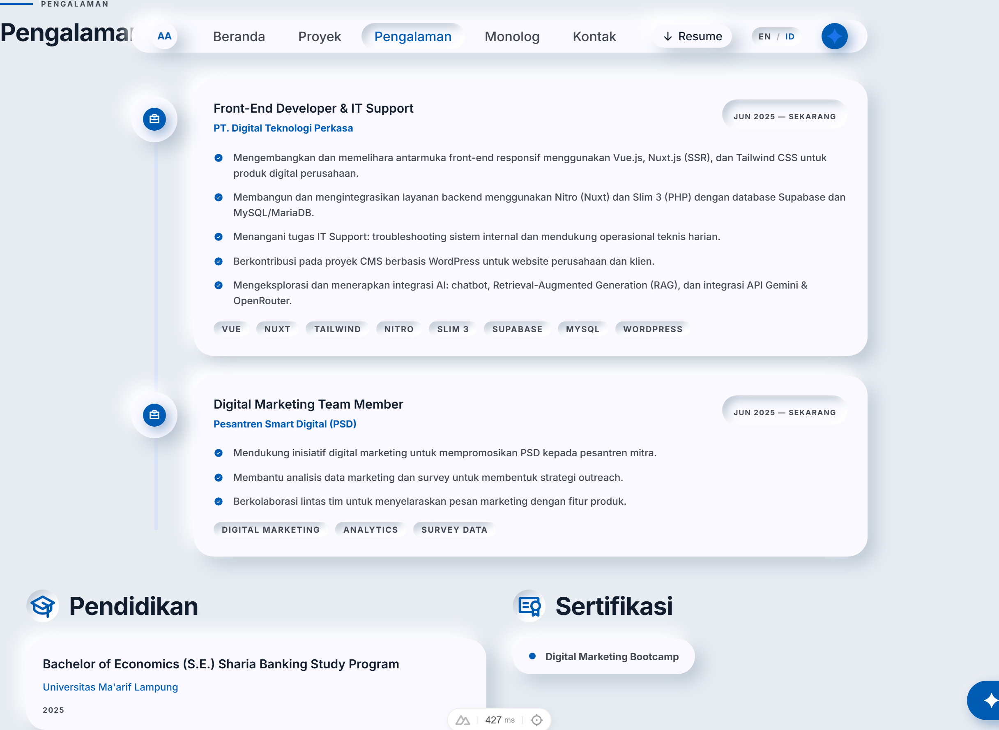 | 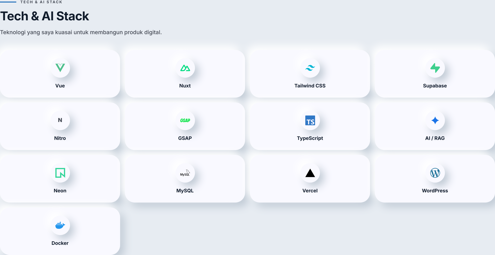 | 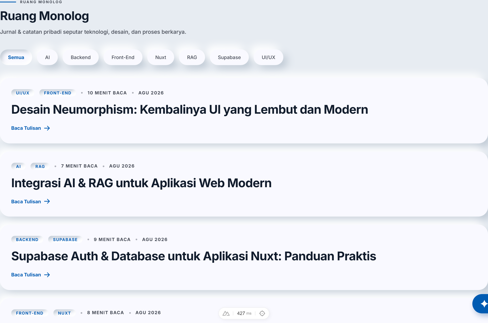 |
| **Experience** | **Tech & AI Stack** | **Thoughts / Writing** |
| 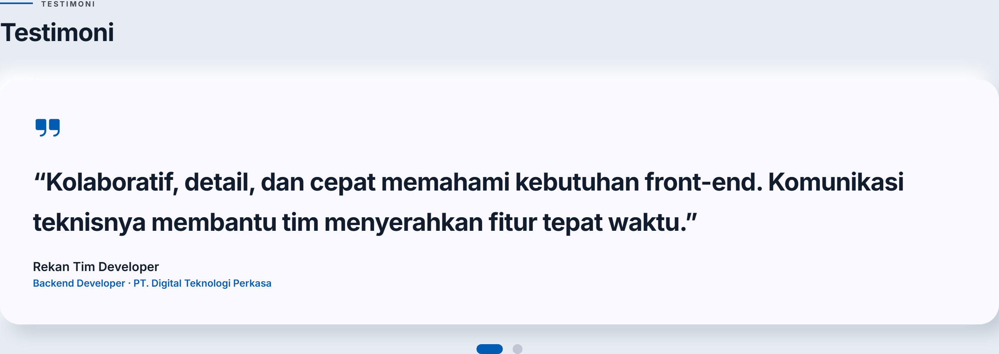 | 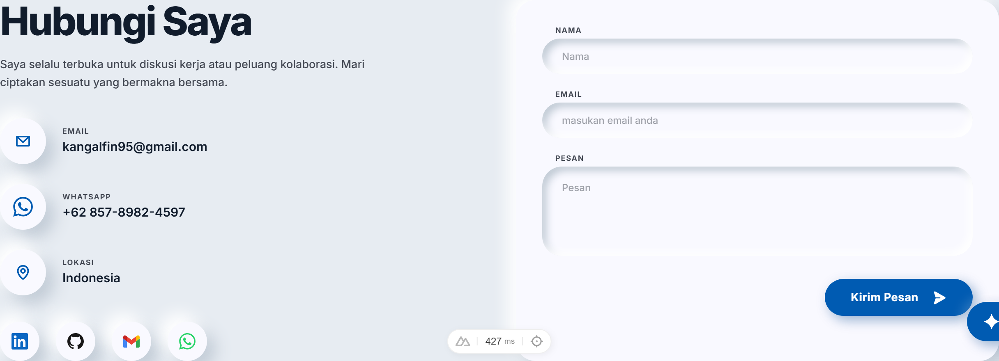 | 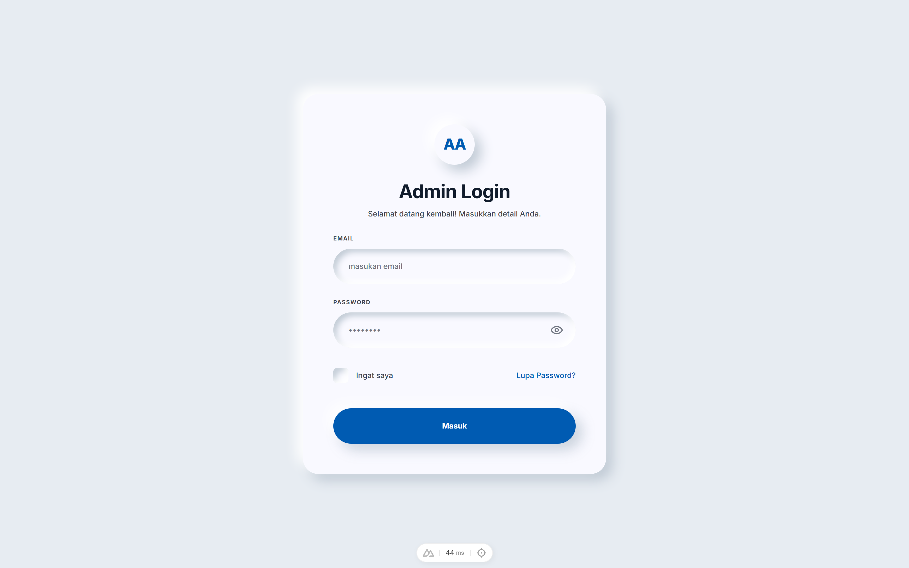 |
| **Testimonials** | **Contact / CTA** | **Admin Login** |

### Mobile Views

<p align="center">
  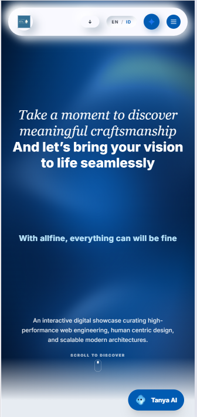
  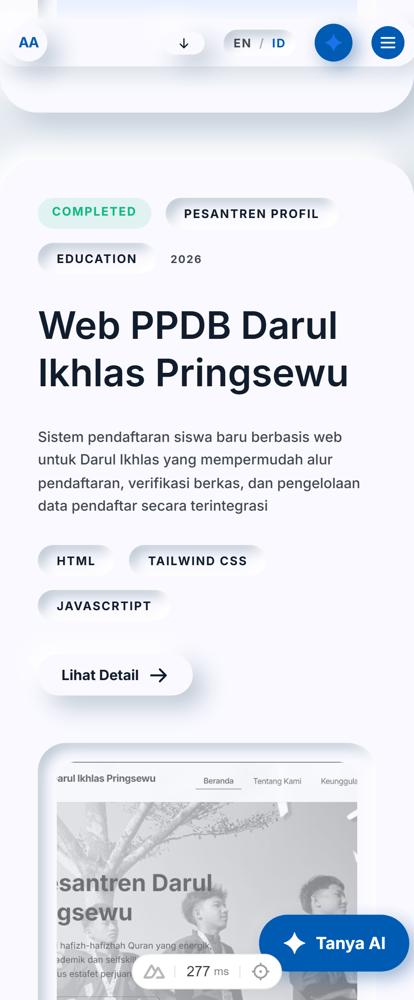
</p>

---

## ✨ Features

- **Hero + About** — professional intro, profile photo, achievement counters & availability status.
- **Featured Projects** — in-depth case studies (Digitek, Elapak Pontren, Al-Hikmah) with role, stack & outcomes.
- **Experience Timeline** — work history at PT. Digital Teknologi Perkasa plus certifications.
- **Tech & AI Stack** — grouped tech skills with icons and AI capabilities (RAG, LLM integration).
- **Thoughts** — short technical writing/journal section.
- **Testimonials** — quotes from colleagues/clients.
- **🤖 AI Assistant (RAG)** — a Gemini-powered chat widget that answers **only** from your own prepared knowledge base (Supabase `pgvector` embeddings + topic policy). Refuses out-of-scope questions — acts as a "digital twin".
- **Contact / CTA** — WhatsApp, email & social links.
- **🌐 i18n** — full Indonesian ↔ English switching via `@nuxtjs/i18n`.
- **🔐 Admin Panel** — dashboard, projects, stacks, thoughts, messages, chat logs, AI knowledge base, visitor analytics & security settings.
- **📊 Visitor Analytics** — anonymous visit tracking with server-side heartbeat.
- **SEO-ready** — SSR rendering, sitemap, robots.txt, Open Graph, dynamic titles & meta.
- **Smooth Motion** — GSAP ScrollTrigger + Lenis smooth scrolling + Motion (Vue) micro-interactions, honoring `prefers-reduced-motion`.
- **Neumorphic design system** — custom Tailwind design tokens (surface cards, raised/pressed shadows).

---

## 🛠 Tech Stack

| Layer | Technology |
|---|---|
| **Framework** | [Nuxt 4](https://nuxt.com) (Universal/SSR) + Vue 3 + TypeScript |
| **Backend & Database** | [Supabase](https://supabase.com) — Postgres, Auth, Storage, `pgvector` |
| **AI Assistant** | Google [Gemini API](https://ai.google.dev) — RAG (retrieval-augmented generation) |
| **Styling** | [Tailwind CSS](https://tailwindcss.com) + custom design tokens |
| **Animation** | [GSAP](https://gsap.com) + [Lenis](https://github.com/darkroomengineering/lenis) + [Motion](https://motion.dev) (`motion-v`) |
| **State & Data** | [Pinia](https://pinia.vuejs.org) + [VueUse](https://vueuse.org) |
| **i18n** | [@nuxtjs/i18n](https://i18n.nuxtjs.org) |
| **SEO** | [@nuxtjs/sitemap](https://sitemap.nuxtjs.org) + [@nuxtjs/robots](https://robots.nuxtjs.org) |
| **Deploy** | Vercel (Nuxt SSR / Nitro) |

---

## 🏗 Architecture

```
┌─────────────┐   SSR / Nitro    ┌──────────────────┐
│   Browser   │ ───────────────▶ │  Nuxt 4 (Nitro)  │
│  (Vue SPA)  │ ◀─────────────── │  server routes   │
└─────────────┘    HTML / JSON   └─────────┬────────┘
      │                                    │  server-side only
      │ useFetch / useAsyncData            ▼
      └─────────────────────────▶ ┌──────────────────────┐
                                  │       Supabase        │
                                  │ Postgres · Auth ·     │
                                  │ pgvector (embeddings) │
                                  └───────────┬──────────┘
                                              ▼
                                     ┌────────────────┐
                                     │  Gemini API    │
                                     │ embed + generate│
                                     └────────────────┘
```

**Rendering strategy** (`nuxt.config.ts` route rules):

| Route | Strategy |
|---|---|
| `/` | Full SSR |
| `/admin/**` | SPA only (client-side) |
| `/api/chat` | Pure Nitro server route, CORS-enabled |

---

## 📁 Project Structure

```
├── app/
│   ├── components/
│   │   ├── public/      # Hero, About, Projects, Stack, Thoughts, Testimonials, Contact, AI widget, navbar, footer
│   │   └── admin/       # Admin forms (Project, Stack, Thought)
│   ├── composables/     # useProjects, useChat, useAuth, useAdmin, useAnalytics, ...
│   ├── layouts/         # default + admin layouts
│   ├── middleware/      # admin auth guard
│   ├── pages/           # index (home), login, admin/* (dashboard, projects, messages, chat-logs, knowledge, analytics, security, ...)
│   └── utils/           # date helpers
├── server/
│   ├── api/             # public + admin API routes (projects, stacks, thoughts, chat, contact, analytics, ...)
│   └── utils/           # auth, supabase, embedding (server-only)
├── database/            # SQL migrations
├── i18n/                # id.json / en.json
├── public/              # static assets (CV, photos, favicon)
├── docs/screenshots/    # README screenshots
└── scripts/             # embedding seeding + screenshot capture
```

---

## 🚀 Getting Started

### Prerequisites

- Node.js **20+**
- A [Supabase](https://supabase.com) project (Postgres + Auth + `pgvector` extension)
- A [Google Gemini API](https://ai.google.dev) key

### Setup

```bash
# install dependencies
npm install

# configure environment
cp .env.example .env.local   # then fill in your values
```

```bash
# development server at http://localhost:3000
npm run dev

# production build & preview
npm run build
npm run preview

# static export
npm run generate
```

### Environment Variables

| Variable | Description |
|---|---|
| `SUPABASE_URL` | Supabase project URL |
| `SUPABASE_KEY` | Supabase publishable/anon key (client-safe) |
| `SUPABASE_SERVICE_ROLE_KEY` | Supabase service role key (**server-only**) |
| `GEMINI_API_KEY` | Google Gemini API key (**server-only**) |
| `NUXT_PUBLIC_SITE_URL` | Public site URL for sitemap/SEO |

> ⚠️ Never expose `SUPABASE_SERVICE_ROLE_KEY` or `GEMINI_API_KEY` to the client. The AI Assistant runs entirely server-side in Nitro routes.

### Database Migrations

Migrations live in [`database/`](database) and set up the schema — including the
`ai_knowledge_chunks` table with embeddings (pgvector) that powers the RAG assistant.
Apply them in your Supabase project, then seed knowledge with:

```bash
node scripts/seed-embeddings.mjs
```

### Regenerate Screenshots

With the dev server running, capture fresh screenshots of the README:

```bash
node scripts/screenshots.mjs
```

---

## 🔍 Under the Hood

- **RAG AI Assistant** — knowledge is chunked, embedded, and stored in `pgvector`; a Nitro server route retrieves the most relevant chunks (similarity search), injects them into a Gemini prompt with a strict topic policy, and streams the answer back. Out-of-scope questions are politely refused.
- **Visitor analytics** — lightweight anonymous tracking with a server-side heartbeat, visible in the admin dashboard.
- **Security** — all admin API routes verify the Supabase JWT server-side; role-protected, client keys only.

---

## 📜 Author

**Alfin Almustajab** — Front-End Developer & IT Support

[](https://www.linkedin.com/alfin-almustajab-630501374/)
[](https://github.com/)
[](mailto:kangalfin95@gmail.com)

---

Built with [Nuxt 4](https://nuxt.com), [Supabase](https://supabase.com) and [Google Gemini](https://ai.google.dev).